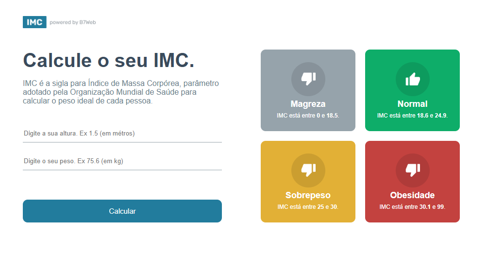

<h1 align="center">Calculadora de IMC</h1>

Projeto em React + TypeScript fazendo uma calculadora de IMC.

  <a href="#-tecnologias">Tecnologias</a>&nbsp;&nbsp;&nbsp;|&nbsp;&nbsp;&nbsp;
  <a href="#-projeto">Projeto</a>&nbsp;&nbsp;&nbsp;|&nbsp;&nbsp;&nbsp;
  <a href="#memo-licença">Licença</a>

  

 

  

## 🚀 Tecnologias

Esse projeto foi desenvolvido com as seguintes tecnologias:

- React
- TypeScript

## Projeto

Esse projeto é para praticar habilidades de lógica de programação, assim como React com TypeScript. Desenvolvido no curso [B7Web](https://b7web.com.br).